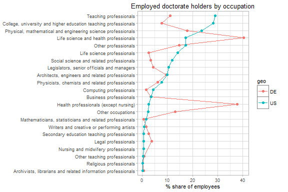

### Introduction

The `eurostatR` package package provides an `R` interface to the [Eurostat API](https://ec.europa.eu/eurostat).

To install the development version:

``` r
library(devtools)
install_github("expersso/eurostatR")
```

### Example usage

Start by retrieving a dataframe with all available data sets:

``` r
library(eurostatR)

flows <- get_dataflows()
head(flows)
```

    ##          id
    ## 1 DS-008573
    ## 2 DS-016890
    ## 3 DS-016893
    ## 4 DS-016894
    ## 5 DS-018995
    ## 6 DS-022469
    ##                                                                                     description
    ## 1 Sold production, exports and imports for steel by PRODCOM list (NACE Rev. 1.1) - monthly data
    ## 2                                                                    EU trade since 1988 by CN8
    ## 3                                                                    EU trade since 1995 by HS6
    ## 4                                                                EU trade since 1988 by HS2-HS4
    ## 5                                                                   EU trade since 1988 by SITC
    ## 6                                         EXTRA EU trade since 1999 by mode of transport (NSTR)

Now, let's say we're interested in the share of employees with a doctorate, broken down by occupation:

``` r
flows[grep("doctorate", flows$description),]
```

    ##             id
    ## 319  cdh_c_neu
    ## 322 cdh_e_diss
    ## 323  cdh_e_fos
    ## 324  cdh_e_fsp
    ## 325  cdh_e_lgt
    ## 326  cdh_e_mob
    ## 327 cdh_e_occ1
    ## 328 cdh_e_occ2
    ## 329 cdh_e_rlgt
    ## 330  cdh_e_une
    ## 332  cdh_m_mov
    ## 333  cdh_m_reg
    ##                                                                                                                    description
    ## 319                                                                    Non-EU doctorate holders in total doctorate holders (%)
    ## 322                                               Level of dissatisfaction of employed doctorate holders by reason and sex (%)
    ## 323                     Employed doctorate holders in non managerial and non professional occupations by fields of science (%)
    ## 324                 Employed doctorate holders working as researchers by sex, fields of science and sectors of performance (%)
    ## 325                         Employed doctorate holders by length of stay with the same employer and sectors of performance (%)
    ## 326    Employed doctorate holders working as researchers by job mobility and sectors of performance over the last 10 years (%)
    ## 327                                                                      Employed doctorate holders by occupation (ISCO_88, %)
    ## 328                                                                      Employed doctorate holders by occupation (ISCO_08, %)
    ## 329                             Employed doctorate holders working as researchers by length of stay with the same employer (%)
    ## 330                                                                Unemployment rate of doctorate holders by fields of science
    ## 332 National doctorate holders having lived or stayed abroad in the past 10 years by reason for returning into the country (%)
    ## 333               National doctorate holders having lived or stayed abroad in the past 10 years by previous region of stay (%)

``` r
id <- "cdh_e_occ1"
```

Before getting the data, we need to know the available dimensions for this data set:

``` r
dims <- get_dimensions(id)
str(dims)
```

    ## List of 3
    ##  $ dimensions:List of 5
    ##   ..$ FREQ  :'data.frame':   7 obs. of  2 variables:
    ##   .. ..$ id         : chr [1:7] "D" "W" "Q" "A" ...
    ##   .. ..$ description: chr [1:7] "Daily" "Weekly" "Quarterly" "Annual" ...
    ##   ..$ GEO   :'data.frame':   18 obs. of  2 variables:
    ##   .. ..$ id         : chr [1:18] "BG" "DK" "DE" "EE" ...
    ##   .. ..$ description: chr [1:18] "Bulgaria" "Denmark" "Germany (until 1990 former territory of the FRG)" "Estonia" ...
    ##   ..$ ISCO88:'data.frame':   26 obs. of  2 variables:
    ##   .. ..$ id         : chr [1:26] "TOTAL" "ISCO1" "ISCO2" "ISCO21" ...
    ##   .. ..$ description: chr [1:26] "Total" "Legislators, senior officials and managers" "Professionals" "Physical, mathematical and engineering science professionals" ...
    ##   ..$ UNIT  :'data.frame':   1 obs. of  2 variables:
    ##   .. ..$ id         : chr "PC"
    ##   .. ..$ description: chr "Percentage"
    ##   ..$ Y_GRAD:'data.frame':   2 obs. of  2 variables:
    ##   .. ..$ id         : chr [1:2] "TOTAL" "Y_GE1990"
    ##   .. ..$ description: chr [1:2] "Total" "1990 and after"
    ##  $ other     :List of 2
    ##   ..$ OBS_FLAG  :'data.frame':   12 obs. of  2 variables:
    ##   .. ..$ id         : chr [1:12] "f" "u" "d" "e" ...
    ##   .. ..$ description: chr [1:12] "forecast" "low reliability" "definition differs, see metadata" "estimated" ...
    ##   ..$ OBS_STATUS:'data.frame':   3 obs. of  2 variables:
    ##   .. ..$ id         : chr [1:3] "na" "-" "0"
    ##   .. ..$ description: chr [1:3] "not available" "not applicable or real zero or zero by default" "less than half of the unit used"
    ##  $ key       : chr "cdh_e_occ1.FREQ.Y_GRAD.UNIT.ISCO88.GEO"

The last value of the returned list (`dims$key`) gives the general form of the key that we need to request. By inspecting the dimensions in the list, we find that `FREQ` should be `A` (annual), `Y_GRAD` should be `TOTAL`, and `UNIT` should be `PC` (percent). The dimension `ISCO88` gives the different occupations, and since we want all of these, we leave that dimension empty. Finally we want to look at date for Germany and the US (`DE` and `US`), which we specify with a `+`.

``` r
key <- "cdh_e_occ1.A.TOTAL.PC..DE+US"
doctorates <- get_data(key)
head(doctorates)
```

    ##   isco88 unit y_grad geo freq obstime obsvalue obs_status
    ## 1  ISCO1   PC  TOTAL  DE    A    2009       NA         na
    ## 2  ISCO1   PC  TOTAL  DE    A    2006     4.47       <NA>
    ## 3  ISCO1   PC  TOTAL  US    A    2009       NA         na
    ## 4  ISCO1   PC  TOTAL  US    A    2006    10.49       <NA>
    ## 5  ISCO2   PC  TOTAL  DE    A    2009       NA         na
    ## 6  ISCO2   PC  TOTAL  DE    A    2006    84.14       <NA>

We can now plot these data as a parallel coordinates plot:

``` r
library(dplyr)
library(ggplot2)

doctorates <- left_join(doctorates, dims$dimensions$ISCO88, 
                        by = c("isco88" = "id"))

# Factor order for occupation variable, in descending order
lvls <- doctorates %>% 
  filter(geo == "US") %>% 
  arrange(obsvalue) %>% 
  .$description

doctorates %>% 
  filter(obstime == 2006) %>% 
  filter(!is.na(obsvalue)) %>% 
  filter(description != "Professionals") %>% 
  ggplot(aes(x = factor(description, lvls), 
             y = obsvalue, fill = geo, color = geo, group = geo)) +
  geom_line() +
  geom_point() +
  coord_flip() +
  theme_light(8) +
  labs(y = "% share of employees", x = NULL,
       title = "Employed doctorate holders by occupation")
```



The chart tells us e.g. that doctorates are much more prevalent among teaching professionals in the US than they are in Germany.

### Disclaimer

This package is in no way officially related to, or endorsed by, the Eurostat.
